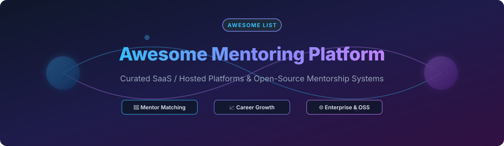

<p align="center">
  
</p>

# 🚀 Awesome Mentoring Platform

<p align="center">
  <a href="https://github.com/ishandutta2007/Awesome-Awesome-Awesome"></a><a href="https://discord.gg/jc4xtF58Ve"></a>
  <a href="https://github.com/ishandutta2007/Awesome-Mentoring-Platform/stargazers"></a>
  <a href="https://github.com/ishandutta2007/Awesome-Mentoring-Platform/network/members"></a>
  <a href="https://github.com/ishandutta2007/Awesome-Mentoring-Platform/blob/main/LICENSE"></a>
  <a href="https://github.com/ishandutta2007"></a>
</p>

## 🌟 Top Mentoring Platform Ecosystem & Architecture Guide

A curated directory of **Enterprise SaaS Mentoring Platforms**, **Open-Source Mentorship Systems**, and **Composable Mentoring Infrastructure**. Designed for HR Tech leaders, Engineering Managers, Community Builders, and Open Source Developers building or evaluating mentoring, coaching, and talent development software.

**Key Focus Areas:** 🤝 Employee Mentoring, 🎯 Career Growth, 👔 Leadership Development, 🤖 AI Mentor–Mentee Matching, 💡 Peer & Reverse Mentoring, 📊 Mentoring Analytics, 🎓 Learning & Development (L&D), and 🌐 Open Source Community Mentoring.

---

## 📋 Table of Contents


* [Overview](#-overview)

* [SaaS/Hosted Platforms](#-saashosted-platforms)

* [Open-Source](#-open-source)


  * [Complete Mentoring Platforms](#1-complete-mentoring-platforms)

  * [Mentor–Mentee Matching Platforms](#2-mentormentee-matching-platforms)

  * [Career & Professional Mentoring](#3-career--professional-mentoring)

  * [Open-Source Community Mentoring](#4-open-source-community-mentoring)

  * [Mentoring Management Systems](#5-mentoring-management-systems)

  * [Scheduling & Session Management](#6-scheduling--session-management)

  * [Community & Collaboration](#7-community--collaboration)

  * [Learning & Development](#8-learning--development)

  * [Goals, Progress & Performance](#9-goals-progress--performance)

  * [Matching, Recommendation & AI](#10-matching-recommendation--ai)

  * [Identity, Authentication & Access](#11-identity-authentication--access)

  * [Analytics & Reporting](#12-analytics--reporting)

* [Commercial → Open-Source Mapping](#-commercial--open-source-mapping)

* [Mentoring Capability Matrix](#-mentoring-capability-matrix)

* [Recommended Open-Source Mentoring Architecture](#-recommended-open-source-mentoring-architecture)

* [Best Open-Source Combinations](#-best-open-source-combinations)

* [Mentoring Lifecycle](#-mentoring-lifecycle)

* [What Open Source Can Replace](#-what-open-source-can-replace)

* [What Open Source Does Not Automatically Replace](#-what-open-source-does-not-automatically-replace)

* [Suggested Open-Source Technology Stack](#-suggested-open-source-technology-stack)

* [Example Mentoring Flow](#-example-mentoring-flow)

* [Privacy & Security](#-privacy--security)

* [Mentoring Governance](#-mentoring-governance)

* [AI & Intelligent Matching](#-ai--intelligent-matching)

* [Open-Source Maturity](#-open-source-maturity)

* [Key Takeaway](#-key-takeaway)

* [How to Contribute](#-how-to-contribute)

* [Disclaimer](#-disclaimer)


---


# 🔎 Overview


Mentoring platforms help organizations create, operate and measure structured relationships between:


* Mentors

* Mentees

* Coaches

* Employees

* Leaders

* Subject-matter experts

* Alumni

* Students

* Professional communities


Modern mentoring platforms increasingly combine:


* Mentor–mentee matching

* Profile management

* Skills mapping

* Career goals

* Program enrollment

* Cohort management

* 1:1 mentoring

* Group mentoring

* Peer mentoring

* Reverse mentoring

* Leadership mentoring

* DEI mentoring

* Career development

* Goal tracking

* Session scheduling

* Meeting agendas

* Progress tracking

* Feedback

* Surveys

* Learning resources

* Communities

* Notifications

* HRIS integration

* LMS integration

* Calendar integration

* Analytics

* ROI measurement

* AI-assisted matching

* AI recommendations

* Engagement nudges


The current enterprise mentoring market includes platforms such as Together, MentorcliQ, Chronus, Qooper, Guider, PushFar, Mentorloop, River and Ten Thousand Coffees. Current industry comparisons also distinguish enterprise mentoring platforms from more specialized mentoring/community offerings.


The open-source ecosystem is considerably smaller than the commercial market, but there are several useful projects that can form the basis of a self-hosted mentoring platform.


```text

                    MENTORING PLATFORM

                           │

          ┌────────────────┴────────────────┐

          │                                 │

   SaaS / Hosted                      Open Source

          │                                 │

   ┌──────┼─────────┐              ┌────────┼─────────┐

   │      │         │              │        │         │

Matching Programs Analytics      Matching  Sessions  Community

   │      │         │              │        │         │

Together Chronus Qooper       MentorMatch FOSSMentoring OpenMentor

MentorcliQ Guider 10KC        AnitaB     Pathment     OpenMentorship

```


---


# ☁️ SaaS/Hosted Platforms

> **📊 Market Size & Structure Insights:**  
> The global Corporate Mentoring & Employee Coaching Software market is estimated at **$1.8 Billion to $2.5 Billion**, projecting a steady **12-15% CAGR**. The sector is **moderately fragmented**: enterprise HR suites (e.g. Together, MentorcliQ, Chronus) dominate enterprise-wide contracts, while a diverse array of mid-market and niche players compete on specialized community, higher-ed, and AI matching capabilities.

| Rank | Platform Name | Valuation / Revenue | Starting Price | Free Tier / Trial Limit | Key Focus & Strengths | Website |
| :---: | :--- | :---: | :---: | :---: | :--- | :--- |
| **1** | **Torch** | **~$700M** *(Est. Valuation)* | $3,000 / year | **14-day Free Trial** *(Up to 5 seats)* | Executive coaching, leadership development & 360 feedback | [Website](https://torch.io/) |
| **2** | **Together** | **~$250M** *(Est. Valuation)* | $500 / month | **Free Tier Available** *(Up to 50 paired users)* | Enterprise employee mentoring, automated matching & HRIS sync | [Website](https://www.togetherplatform.com/) |
| **3** | **MentorcliQ** | **~$150M** *(Est. Valuation)* | $6,000 / year | **14-day Free Demo Trial** *(Admin sandbox access)* | High-scale employee mentoring, ERGs, reverse & group mentoring | [Website](https://www.mentorcliq.com/) |
| **4** | **Chronus** | **~$100M** *(Est. Valuation)* | $7,500 / year | **14-day Demo Sandbox** *(Full admin preview)* | Talent development, succession planning & enterprise program admin | [Website](https://chronus.com/) |
| **5** | **Ten Thousand Coffees (10KC)** | **~$80M** *(Est. Valuation)* | $5,000 / year | **30-day Free Trial** *(Hub introduction preview)* | Smart informal networking, coffee chats & community engagement | [Website](https://www.tenthousandcoffees.com/) |
| **6** | **Qooper** | **~$50M** *(Est. Valuation)* | $3,000 / year | **14-day Free Trial** *(Up to 15 users)* | AI matching, coaching, learning resources & mobile apps | [Website](https://www.qooper.io/) |
| **7** | **PushFar** | **~$35M** *(Est. Valuation)* | $95 / month | **Free Forever Plan** *(1:1 mentorship & basic profile)* | Open networking, community mentoring & goal tracking | [Website](https://www.pushfar.com/) |
| **8** | **Guider** | **~$30M** *(Est. Valuation)* | $4,000 / year | **14-day Demo Trial** *(Guided program setup)* | DEI mentoring, onboarding & career development workflows | [Website](https://www.guider-ai.com/) |
| **9** | **Mentorloop** | **~$25M** *(Est. Valuation)* | $299 / month | **Free Forever Plan** *(Up to 20 active pairs)* | Flexible program matching, self-match & loop analytics | [Website](https://mentorloop.com/) |
| **10** | **Mentor Collective** | **~$20M** *(Est. Valuation)* | $10,000 / year | **30-day Pilot Trial** *(Higher-Ed cohort demo)* | Higher-ed peer mentoring, student success & alumni engagement | [Website](https://www.mentorcollective.org/) |
| **11** | **MindTools Connect** | **~$20M** *(Est. Valuation)* | $1,500 / year | **7-day Free Trial** *(Full L&D content library)* | L&D content integration, skill building & peer learning | [Website](https://www.mindtools.com/) |
| **12** | **River** | **~$15M** *(Est. Valuation)* | $3,600 / year | **14-day Demo Sandbox** *(Program administrative access)* | Structured organizational mentoring & progress reporting | [Website](https://www.river.com/) |
| **13** | **MentorCloud** | **~$10M** *(Est. Valuation)* | $2,400 / year | **14-day Free Trial** *(Up to 10 user profiles)* | Community coaching, mentor discovery & wisdom sharing | [Website](https://mentorcloud.com/) |
| **14** | **MentorCity** | **~$5M** *(Est. Valuation)* | $150 / month | **Free Forever Plan** *(1 match per user)* | Association mentoring, self-directed matching & surveys | [Website](https://mentorcity.com/) |
| **15** | **Mentornity** | **~$3M** *(Est. Valuation)* | $99 / month | **14-day Free Trial** *(Full program tools)* | Startup incubators, community mentoring & meeting notes | [Website](https://mentornity.com/) |
| **16** | **Mentorink** | **~$2M** *(Est. Valuation)* | $199 / month | **14-day Free Trial** *(Up to 25 participants)* | Smart guided mentoring journeys & skill-based matching | [Website](https://mentorink.com/) |

---

# 🧩 Open-Source


> **Important:** The open-source mentoring ecosystem is much less consolidated than the commercial market.


> There is currently no single widely adopted open-source platform that provides the entire feature set of Together + MentorcliQ + Chronus + Qooper + Guider + PushFar + Mentorloop + 10KC as a turnkey enterprise product.


Instead, open-source mentoring platforms generally fall into two categories:


1. **Complete or semi-complete mentoring applications**

2. **Composable building blocks for creating a mentoring platform**


This makes an open-source architecture particularly useful for organizations that want to control their:


* Matching algorithms

* Participant data

* Mentoring workflows

* Program structure

* Integrations

* Deployment

* AI models

* Analytics

* Data retention


---


# 1. Complete Mentoring Platforms


## FOSSMentoring / OpenMentoringPlatform


**GitHub:** https://github.com/RajGM/OpenMentoringPlatform


FOSSMentoring is an open-source mentoring application designed to provide a substantial set of mentoring-platform capabilities.


**Key Features:**


* Mentor profiles

* Mentor feed

* Availability

* Scheduling

* Real-time chat

* Media sharing

* Community

* Opportunities hub

* Blogging

* API integration

* Authentication

* Mentor discovery


The project documentation describes it as a deployable mentoring platform rather than merely a sample matching algorithm.


---


## Pathment


**GitHub:** https://github.com/pathment/pathment


Open-source platform for structured mentor-led development programs.


**Key Features:**


* Applications

* Assessment

* Mentor placement

* Cohorts

* Mentor-led programs

* Roadmaps

* Tasks

* Reviews

* Video sessions

* Scheduling

* Messaging

* Community feed

* Progress analytics


The repository describes Pathment as an open-source platform for structured mentor-led programs and an end-to-end workflow from application through mentoring and graduation.


---


## OpenMentor


**GitHub:** https://github.com/OpenMentor/OpenMentor


Open-source mentoring community platform.


**Key Features:**


* Mentor discovery

* Mentee discovery

* Mentor profiles

* Community

* Knowledge sharing

* 1:1 mentoring


The project is explicitly designed around connecting people seeking mentorship with people willing to mentor.


---


## OpenMentorship


**GitHub:** https://github.com/legend-crypt/OpenMentorship


Open-source mentoring platform oriented toward connecting experienced contributors with newcomers.


**Key Features:**


* Mentor discovery

* Mentee discovery

* Mentorship sessions

* Messaging

* Video/voice communication

* Learning resources

* Open-source project discovery


---


# 2. Mentor–Mentee Matching Platforms


## MentorMatch


**GitHub:** https://github.com/timemir/MentorMatch


Full-stack mentor/mentee matching application.


**Key Features:**


* Mentor profiles

* Mentee profiles

* Matching algorithm

* Preferences

* Location

* Interests

* Availability

* Dashboard

* Chat

* Match status

* Ratings


The project specifically describes matching users according to preferences such as learning mode, location and interests.


---


## Mentor-Mentee Management System


**GitHub:** https://github.com/THEAYUSHIMISHRA/Mentor-Mentee-System


Web-based mentor/mentee management application.


**Key Features:**


* Mentor registration

* Mentee registration

* Profiles

* Matching

* Scheduling

* Calendar

* Attendance

* Messaging

* Feedback

* Admin dashboard

* Announcements

* Events


---


## Ment-To-Be


**GitHub:** https://github.com/UCR-CS110/Ment-To-be


Mentoring platform focused on connecting computer-science students with industry professionals.


**Key Features:**


* Mentor registration

* Mentee registration

* Matching

* Availability

* Career guidance

* Chat

* Feedback

* Reputation

* Achievements


---


## MentorMe


**GitHub:** https://github.com/AhmadGhachim/MentorMe


Web-based mentoring community.


**Key Features:**


* Mentor discovery

* Mentee discovery

* Career guidance

* Skill development

* Community

* Professional networking


---


# 3. Career & Professional Mentoring


## AnitaB.org Mentorship System


**GitHub:** https://github.com/anitab-org/mentorship-backend


A particularly relevant open-source mentoring system for structured career mentoring.


The backend supports:


* Registration

* Profiles

* Mentor/mentee relationships

* Fixed-duration mentoring

* Tasks

* REST API

* JWT authentication

* Docker

* Multiple frontends


The project is licensed under GPL-3.0.


Associated frontends include:


* https://github.com/anitab-org/mentorship-android

* https://github.com/anitab-org/mentorship-ios

* https://github.com/anitab-org/mentorship-flutter


---


## Open Source Mentorship Program


**GitHub:** https://github.com/OS-Mentors/mentorship


A structured open-source mentorship program implementation/reference project.


**Key Concepts:**


* Mentor enrollment

* Mentee enrollment

* Matching

* Goal setting

* Kickoff

* Regular meetings

* Communication

* Code review

* Progress

* Community

* Mentor/mentee expectations


The project explicitly documents mentor/mentee matching based on language, goals and preferences.


---


# 4. Open-Source Community Mentoring


## CNCF Mentoring


**GitHub:** https://github.com/cncf/mentoring


CNCF's open-source mentoring program repository.


It provides:


* Mentor resources

* Mentee resources

* Program information

* Project ideas

* Mentoring guidance

* Community processes


This is more of a **mentoring-program implementation/resource repository** than a turnkey SaaS replacement.


---


## OpenMentorship


https://github.com/legend-crypt/OpenMentorship


Useful for:


* Open-source mentoring

* Mentor discovery

* Sessions

* Learning

* Communication


---


## OpenMentor


https://github.com/OpenMentor/OpenMentor


Useful for:


* Mentor discovery

* Community mentoring

* Skill sharing

* Peer learning


---


# 5. Mentoring Management Systems


## Mentorship Platform


**GitHub:** https://github.com/Temitope3003/mentorship_platform


Full-stack mentoring management application.


**Features:**


* User registration

* Authentication

* Mentor profiles

* Mentee profiles

* Matching

* Session scheduling

* Session tracking

* Progress monitoring

* Email reminders

* Milestones

* Admin dashboard

* Docker deployment

* CI/CD


The project uses Node.js/TypeScript, MySQL, Docker and GitHub Actions.


---


## Mentorship Platform Server


**GitHub:** https://github.com/karankumar12345/mentorship-platform-server


Backend for a mentoring platform.


**Features:**


* Authentication

* Mentor/mentee management

* Profile management

* Matching

* Skills

* Preferences

* Availability

* Notifications

* Session scheduling


**Stack:**


* Node.js

* Express

* MongoDB

* JWT

* Mongoose


---


## Mentor-Mentee Management System


https://github.com/THEAYUSHIMISHRA/Mentor-Mentee-System


Useful as a self-hosted starting point for:


* Academic mentoring

* Employee mentoring

* Structured programs

* Scheduling

* Messaging

* Feedback


---


# 6. Scheduling & Session Management


A production mentoring platform needs more than matching.


The typical lifecycle is:


```text

Mentor

   │

   ├── Availability

   │

   ├── Calendar

   │

   └── Time Slots

            │

            ▼

        Match Created

            │

            ▼

       Session Booking

            │

            ▼

       Calendar Event

            │

            ▼

        Meeting

            │

            ▼

       Feedback / Notes

            │

            ▼

        Goal Progress

```


Useful open-source components:


### Cal.com


**GitHub:** https://github.com/calcom/cal.com


Open-source scheduling infrastructure.


Useful for:


* Availability

* Booking

* Calendars

* Meeting scheduling

* Time zones

* Integrations


---


### Nextcloud Calendar


**GitHub:** https://github.com/nextcloud/calendar


Useful for:


* Calendar management

* Events

* Scheduling

* Personal availability


---


### Jitsi Meet


**GitHub:** https://github.com/jitsi/jitsi-meet


Open-source video conferencing.


Useful for:


* Mentor/mentee meetings

* Group mentoring

* Workshops

* Cohort sessions


---


# 7. Community & Collaboration


## Mattermost


**GitHub:** https://github.com/mattermost/mattermost


Self-hosted collaboration platform useful for mentoring communities.


---


## Matrix / Synapse


**GitHub:** https://github.com/element-hq/synapse


Open-source communication infrastructure useful for:


* Mentor communities

* Private mentoring channels

* Group conversations

* Notifications


---


## Rocket.Chat


**GitHub:** https://github.com/RocketChat/Rocket.Chat


Useful for:


* Community mentoring

* Group mentoring

* Mentor channels

* Direct messaging


---


## Discourse


**GitHub:** https://github.com/discourse/discourse


Useful for:


* Mentoring communities

* Discussion

* Knowledge sharing

* Mentor forums

* Community Q&A


---


# 8. Learning & Development


## Moodle


**GitHub:** https://github.com/moodle/moodle


Open-source LMS useful for connecting mentoring with structured learning.


**Potential integration:**


```text

Moodle

  │

  ├── Courses

  ├── Learning Plans

  ├── Assessments

  └── Resources

          │

          ▼

      Mentoring

          │

          ├── Mentor

          ├── Mentee

          └── Goals

```


---


## Open edX


**GitHub:** https://github.com/openedx/edx-platform


Open-source learning platform useful for:


* Courses

* Learning paths

* Professional development

* Mentor-assisted learning


---


## Canvas LMS


**GitHub:** https://github.com/instructure/canvas-lms


Open-source LMS that can complement mentoring programs.


---


# 9. Goals, Progress & Performance


## OpenProject


**GitHub:** https://github.com/opf/openproject


Project-management platform useful for structured mentoring goals and action plans.


---


## Taiga


**GitHub:** https://github.com/taigaio/taiga-back


Agile/project management platform useful for:


* Mentoring tasks

* Action plans

* Progress

* Milestones


---


## Plane


**GitHub:** https://github.com/makeplane/plane


Project and issue management platform that can be adapted for mentoring action plans.


---


# 10. Matching, Recommendation & AI


Mentor matching is one of the most important components of enterprise mentoring.


A typical matching model can consider:


```text

Mentor Profile

     │

     ├── Skills

     ├── Experience

     ├── Industry

     ├── Location

     ├── Language

     ├── Availability

     ├── Career Experience

     └── Interests

              │

              ▼

       Matching Engine

              │

       ┌──────┼──────┐

       ▼      ▼      ▼

    Skills  Goals  Preferences

       │      │      │

       └──────┼──────┘

              ▼

         Match Score

              │

              ▼

        Mentor / Mentee

```


---


## Scikit-learn


**GitHub:** https://github.com/scikit-learn/scikit-learn


Useful for:


* Recommendation

* Similarity scoring

* Classification

* Clustering

* Matching models


---


## Sentence Transformers


**GitHub:** https://github.com/UKPLab/sentence-transformers


Useful for semantic matching between:


* Mentor skills

* Mentee goals

* Career interests

* Job roles

* Learning objectives


---


## FAISS


**GitHub:** https://github.com/facebookresearch/faiss


Efficient vector similarity search.


Useful for:


* Mentor discovery

* Semantic matching

* Skill similarity

* Profile recommendations


---


## Qdrant


**GitHub:** https://github.com/qdrant/qdrant


Open-source vector database.


Useful for:


* Mentor embeddings

* Mentee embeddings

* Semantic search

* AI recommendations


---


## Weaviate


**GitHub:** https://github.com/weaviate/weaviate


Open-source vector database suitable for semantic mentor matching.


---


## pgvector


**GitHub:** https://github.com/pgvector/pgvector


Vector similarity extension for PostgreSQL.


Useful for:


* Mentor embeddings

* Mentee embeddings

* Skill vectors

* Recommendation systems


---


# 11. Identity, Authentication & Access


## Keycloak


**GitHub:** https://github.com/keycloak/keycloak


Useful for:


* SSO

* OIDC

* OAuth2

* RBAC

* Organizations

* Identity federation


---


## Authentik


**GitHub:** https://github.com/goauthentik/authentik


Self-hosted identity provider.


---


## OpenFGA


**GitHub:** https://github.com/openfga/openfga


Fine-grained authorization engine useful for:


* Mentor access

* Mentee access

* Program access

* Admin roles

* Organization boundaries


---


# 12. Analytics & Reporting


## Metabase


**GitHub:** https://github.com/metabase/metabase


Useful for:


* Mentoring participation

* Match success

* Session completion

* Goal progress

* Program analytics


---


## Apache Superset


**GitHub:** https://github.com/apache/superset


Useful for:


* Executive dashboards

* Mentoring KPIs

* DEI analytics

* Program performance


---


## Grafana


**GitHub:** https://github.com/grafana/grafana


Useful for:


* Operational dashboards

* Engagement metrics

* Platform monitoring

* Real-time mentoring analytics


---


# 🧱 Additional Strong Open-Source Options


| Project                                                                         | Primary Role                  | Mentoring Relevance |

| ------------------------------------------------------------------------------- | ----------------------------- | ------------------: |

| [FOSSMentoring](https://github.com/RajGM/OpenMentoringPlatform)                 | Complete Mentoring Platform   |               ⭐⭐⭐⭐⭐ |

| [Pathment](https://github.com/pathment/pathment)                                | Structured Mentoring          |               ⭐⭐⭐⭐⭐ |

| [AnitaB Mentorship](https://github.com/anitab-org/mentorship-backend)           | Career Mentoring              |               ⭐⭐⭐⭐⭐ |

| [MentorMatch](https://github.com/timemir/MentorMatch)                           | Matching                      |               ⭐⭐⭐⭐⭐ |

| [Ment-To-Be](https://github.com/UCR-CS110/Ment-To-be)                           | Student/Professional Matching |                ⭐⭐⭐⭐ |

| [OpenMentor](https://github.com/OpenMentor/OpenMentor)                          | Mentoring Community           |                ⭐⭐⭐⭐ |

| [OpenMentorship](https://github.com/legend-crypt/OpenMentorship)                | Open-Source Mentoring         |                ⭐⭐⭐⭐ |

| [Mentorship Platform](https://github.com/Temitope3003/mentorship_platform)      | Management                    |                ⭐⭐⭐⭐ |

| [Mentor-Mentee System](https://github.com/THEAYUSHIMISHRA/Mentor-Mentee-System) | Management                    |                ⭐⭐⭐⭐ |

| [MentorMe](https://github.com/AhmadGhachim/MentorMe)                            | Mentor Marketplace            |                ⭐⭐⭐⭐ |

| [OS-Mentors](https://github.com/OS-Mentors/mentorship)                          | Program Framework             |                ⭐⭐⭐⭐ |

| [CNCF Mentoring](https://github.com/cncf/mentoring)                             | Mentoring Program             |                 ⭐⭐⭐ |

| [Cal.com](https://github.com/calcom/cal.com)                                    | Scheduling                    |                ⭐⭐⭐⭐ |

| [Jitsi Meet](https://github.com/jitsi/jitsi-meet)                               | Video Meetings                |                ⭐⭐⭐⭐ |

| [Mattermost](https://github.com/mattermost/mattermost)                          | Collaboration                 |                ⭐⭐⭐⭐ |

| [Rocket.Chat](https://github.com/RocketChat/Rocket.Chat)                        | Community                     |                ⭐⭐⭐⭐ |

| [Discourse](https://github.com/discourse/discourse)                             | Community                     |                ⭐⭐⭐⭐ |

| [Moodle](https://github.com/moodle/moodle)                                      | Learning                      |                ⭐⭐⭐⭐ |

| [Open edX](https://github.com/openedx/edx-platform)                             | Learning                      |                ⭐⭐⭐⭐ |

| [Keycloak](https://github.com/keycloak/keycloak)                                | Identity                      |                ⭐⭐⭐⭐ |

| [OpenFGA](https://github.com/openfga/openfga)                                   | Authorization                 |                 ⭐⭐⭐ |

| [Qdrant](https://github.com/qdrant/qdrant)                                      | Semantic Matching             |                ⭐⭐⭐⭐ |

| [FAISS](https://github.com/facebookresearch/faiss)                              | Similarity Search             |                ⭐⭐⭐⭐ |

| [pgvector](https://github.com/pgvector/pgvector)                                | Vector Search                 |                ⭐⭐⭐⭐ |

| [Sentence Transformers](https://github.com/UKPLab/sentence-transformers)        | Semantic Matching             |               ⭐⭐⭐⭐⭐ |

| [Metabase](https://github.com/metabase/metabase)                                | Analytics                     |                 ⭐⭐⭐ |

| [Superset](https://github.com/apache/superset)                                  | Analytics                     |                 ⭐⭐⭐ |

| [Grafana](https://github.com/grafana/grafana)                                   | Analytics                     |                 ⭐⭐⭐ |


---


# 🔄 Commercial → Open-Source Mapping


| Commercial Platform      | Comparable Open-Source Options                        |

| ------------------------ | ----------------------------------------------------- |

| **Together**             | FOSSMentoring + Cal.com + Jitsi + Metabase            |

| **MentorcliQ**           | Pathment + FOSSMentoring + Keycloak + Metabase        |

| **Chronus**              | AnitaB Mentorship + FOSSMentoring + Moodle + Superset |

| **Qooper**               | Pathment + MentorMatch + Moodle + Qdrant              |

| **Guider**               | FOSSMentoring + MentorMatch + Moodle                  |

| **PushFar**              | OpenMentor + FOSSMentoring + Discourse                |

| **Mentorloop**           | FOSSMentoring + OpenMentor + Metabase                 |

| **River**                | AnitaB Mentorship + Pathment + OpenProject            |

| **MindTools Connect**    | Moodle + Open edX + FOSSMentoring + Discourse         |

| **Ten Thousand Coffees** | OpenMentor + FOSSMentoring + Mattermost + Qdrant      |

| **MentorCloud**          | FOSSMentoring + OpenMentorship                        |

| **MentorCity**           | FOSSMentoring + MentorMatch + Cal.com                 |

| **Mentor Collective**    | MentorMatch + Moodle + Discourse                      |

| **Mentornity**           | FOSSMentoring + MentorMatch + Metabase                |

| **Torch**                | Moodle + FOSSMentoring + Jitsi + analytics stack      |


> These are **architectural equivalents**, not claims of complete feature-for-feature parity.


---


# 📊 Mentoring Capability Matrix


| Platform                | Matching | Programs | Goals | Sessions | Community | Analytics | AI Matching | Learning |

| ----------------------- | -------: | -------: | ----: | -------: | --------: | --------: | ----------: | -------: |

| Together                |        ✅ |        ✅ |     ✅ |        ✅ |         ✅ |         ✅ |           ✅ |        ✅ |

| MentorcliQ              |        ✅ |        ✅ |     ✅ |        ✅ |         ✅ |         ✅ |           ✅ |        ✅ |

| Chronus                 |        ✅ |        ✅ |     ✅ |        ✅ |         ✅ |         ✅ |           ✅ |        ✅ |

| Qooper                  |        ✅ |        ✅ |     ✅ |        ✅ |         ✅ |         ✅ |           ✅ |        ✅ |

| Guider                  |        ✅ |        ✅ |     ✅ |        ✅ |         ✅ |         ✅ |           ✅ |       ⚠️ |

| PushFar                 |        ✅ |        ✅ |     ✅ |        ✅ |         ✅ |         ✅ |          ⚠️ |       ⚠️ |

| Mentorloop              |        ✅ |        ✅ |     ✅ |        ✅ |         ✅ |         ✅ |          ⚠️ |       ⚠️ |

| 10KC                    |        ✅ |        ✅ |    ⚠️ |       ⚠️ |         ✅ |         ✅ |          ⚠️ |       ⚠️ |

| **FOSSMentoring**       |       ⚠️ |       ⚠️ |    ⚠️ |        ✅ |         ✅ |        ⚠️ |           ❌ |       ⚠️ |

| **Pathment**            |       ⚠️ |        ✅ |     ✅ |        ✅ |         ✅ |         ✅ |          ⚠️ |       ⚠️ |

| **AnitaB Mentorship**   |        ✅ |        ✅ |     ✅ |       ⚠️ |        ⚠️ |        ⚠️ |           ❌ |       ⚠️ |

| **MentorMatch**         |        ✅ |       ⚠️ |    ⚠️ |       ⚠️ |        ⚠️ |        ⚠️ |          ⚠️ |        ❌ |

| **OpenMentor**          |       ⚠️ |       ⚠️ |    ⚠️ |       ⚠️ |         ✅ |        ⚠️ |           ❌ |       ⚠️ |

| **Ment-To-Be**          |        ✅ |       ⚠️ |    ⚠️ |        ✅ |        ⚠️ |        ⚠️ |           ❌ |       ⚠️ |

| **Mentorship Platform** |        ✅ |        ✅ |     ✅ |        ✅ |        ⚠️ |         ✅ |          ⚠️ |       ⚠️ |


**Legend:**


* ✅ = Strong/native capability

* ⚠️ = Possible through integration/customization

* ❌ = Not a primary capability


---


# 🏗️ Recommended Open-Source Mentoring Architecture


```text

                         ┌──────────────────────────────┐

                         │       PARTICIPANTS           │

                         │                              │

                         │ Mentors │ Mentees │ Admins  │

                         └──────────────┬───────────────┘

                                        │

                                        ▼

                         ┌──────────────────────────────┐

                         │       MENTORING PORTAL       │

                         │                              │

                         │ Profiles │ Programs │ Goals │

                         │ Matching │ Sessions │ Feed  │

                         └──────────────┬───────────────┘

                                        │

                                        ▼

                         ┌──────────────────────────────┐

                         │      MATCHING ENGINE         │

                         │                              │

                         │ Skills │ Goals │ Experience │

                         │ Interests │ Availability    │

                         └──────────────┬───────────────┘

                                        │

                    ┌───────────────────┼───────────────────┐

                    │                   │                   │

                    ▼                   ▼                   ▼

             ┌────────────┐     ┌────────────┐     ┌────────────┐

             │   Qdrant   │     │  pgvector  │     │  FAISS     │

             │            │     │            │     │            │

             └────────────┘     └────────────┘     └────────────┘

                    │                   │                   │

                    └───────────────────┼───────────────────┘

                                        │

                                        ▼

                               MATCH RECOMMENDATION

                                        │

                                        ▼

                         ┌───────────────────────────┐

                         │     PROGRAM ENGINE        │

                         │                           │

                         │ Cohorts │ 1:1 │ Groups   │

                         │ Reverse │ Peer │ Circles │

                         └────────────┬──────────────┘

                                      │

                ┌─────────────────────┼─────────────────────┐

                │                     │                     │

                ▼                     ▼                     ▼

           ┌─────────┐          ┌──────────┐          ┌──────────┐

           │ Cal.com │          │ Jitsi    │          │ Chat     │

           │         │          │ Meet     │          │          │

           └─────────┘          └──────────┘          └──────────┘

                │                     │                     │

                └─────────────────────┼─────────────────────┘

                                      │

                                      ▼

                           GOALS / PROGRESS / FEEDBACK

                                      │

                                      ▼

                         ┌────────────────────────────┐

                         │       ANALYTICS            │

                         │                            │

                         │ Metabase / Superset        │

                         │ Grafana                    │

                         └────────────────────────────┘

```


---


# 🧩 Best Open-Source Combinations


## Combination 1 — Enterprise Employee Mentoring


```text

FOSSMentoring

      +

Keycloak

      +

Cal.com

      +

Jitsi

      +

Qdrant

      +

Metabase

```


Suitable for:


* Employee mentoring

* Leadership development

* Career development

* Structured programs

* Mentor matching

* Analytics


---


## Combination 2 — AI-Powered Mentoring


```text

FOSSMentoring

      +

Sentence Transformers

      +

Qdrant

      +

PostgreSQL

      +

LLM

      +

Metabase

```


Potential capabilities:


* Semantic mentor matching

* Skill similarity

* Career-goal matching

* Personalized recommendations

* Mentor discovery

* AI-generated mentoring suggestions


---


## Combination 3 — University / Student Mentoring


```text

Ment-To-Be

     +

Moodle

     +

Cal.com

     +

Jitsi

     +

Discourse

     +

Metabase

```


Suitable for:


* Alumni mentoring

* Student mentoring

* Career guidance

* Faculty mentoring

* Industry mentoring


---


## Combination 4 — Open-Source Community Mentoring


```text

OpenMentor

     +

Discourse

     +

Jitsi

     +

Keycloak

     +

Qdrant

```


Suitable for:


* Open-source communities

* Professional associations

* Developer communities

* Volunteer mentoring

* Peer learning


---


## Combination 5 — Structured Corporate Development


```text

Pathment

   +

Keycloak

   +

Cal.com

   +

Jitsi

   +

Moodle

   +

Metabase

```


Suitable for:


* Cohort programs

* Career acceleration

* Leadership programs

* Skill development

* Structured learning


---


# 🔁 Mentoring Lifecycle


```text

1. PROGRAM DESIGN

        │

        ▼

2. DEFINE ELIGIBILITY

        │

        ▼

3. MENTOR ENROLLMENT

        │

        ▼

4. MENTEE ENROLLMENT

        │

        ▼

5. PROFILE COLLECTION

        │

        ▼

6. SKILLS / GOALS / PREFERENCES

        │

        ▼

7. MATCHING

        │

        ▼

8. MATCH ACCEPTANCE

        │

        ▼

9. KICKOFF

        │

        ▼

10. SESSION SCHEDULING

        │

        ▼

11. REGULAR MENTORING

        │

        ▼

12. GOAL TRACKING

        │

        ▼

13. FEEDBACK

        │

        ▼

14. ENGAGEMENT ANALYTICS

        │

        ▼

15. PROGRAM REVIEW

        │

        ▼

16. GRADUATION / RENEWAL

```


---


# 🧠 Mentoring Program Types


A flexible open-source platform should support:


```text

                     MENTORING

                         │

       ┌─────────────────┼──────────────────┐

       │                 │                  │

       ▼                 ▼                  ▼

      1:1              GROUP              PEER

       │                 │                  │

       ▼                 ▼                  ▼

  Mentor/Mentee       Circles          Peer Learning

       │

       ├──────────────┐

       │              │

       ▼              ▼

   Reverse         Cross-

   Mentoring       Functional

       │              │

       └──────┬───────┘

              ▼

         Leadership

         Mentoring

```


---


# 🎯 Goals & Development


Mentoring should be driven by measurable goals.


```text

Mentee

  │

  ▼

Career Goal

  │

  ├── Skill Goal

  │

  ├── Leadership Goal

  │

  ├── Technical Goal

  │

  ├── Networking Goal

  │

  └── Development Goal

          │

          ▼

       Action Plan

          │

          ▼

       Mentor Sessions

          │

          ▼

        Milestones

          │

          ▼

        Feedback

          │

          ▼

        Progress

```


---


# 🤖 AI & Intelligent Matching


AI can enhance mentoring platforms without replacing human relationships.


Potential matching inputs:


```text

Mentor

 ├── Skills

 ├── Experience

 ├── Industry

 ├── Seniority

 ├── Location

 ├── Language

 ├── Availability

 ├── Interests

 └── Mentoring Style


Mentee

 ├── Goals

 ├── Skills to Learn

 ├── Career Path

 ├── Industry

 ├── Location

 ├── Language

 ├── Availability

 ├── Interests

 └── Preferred Style

```


A matching engine can calculate:


```text

Match Score =

    Skill Compatibility

  + Goal Compatibility

  + Industry Compatibility

  + Experience Compatibility

  + Availability Compatibility

  + Language Compatibility

  + Interest Compatibility

  + Preference Compatibility

```


Example:


```text

Mentor A

   │

   ├── Python: 95%

   ├── AI: 90%

   ├── Leadership: 80%

   └── Availability: 85%

             │

             ▼

       Matching Engine

             ▲

             │

Mentee B

   │

   ├── Python Goal: 90%

   ├── AI Goal: 95%

   ├── Leadership Goal: 60%

   └── Availability: 80%

             │

             ▼

        Match Score

```


---


# 🧬 Semantic Mentor Matching


Traditional matching uses explicit fields.


Modern systems can additionally use semantic embeddings:


```text

Mentor Profile

      │

      ▼

Embedding Model

      │

      ▼

Vector

      │

      ▼

Vector Database

      │

      ▲

      │

Mentee Goals

      │

      ▼

Embedding Model

```


Recommended open-source components:


* Sentence Transformers

* Qdrant

* Weaviate

* FAISS

* pgvector


This can enable matching based on the **meaning of career goals**, rather than only exact keyword matches.


---


# 🔌 Enterprise Integrations


A serious enterprise mentoring platform should integrate with:


### HRIS


* Workday

* SAP SuccessFactors

* BambooHR

* HiBob

* UKG

* ADP


### Collaboration


* Microsoft Teams

* Slack

* Zoom

* Google Meet


### Calendar


* Google Calendar

* Microsoft Outlook

* CalDAV


### Learning


* Moodle

* Open edX

* LMS platforms


### Identity


* Azure AD / Entra ID

* Okta

* Keycloak

* Auth0


### Analytics


* Power BI

* Tableau

* Metabase

* Superset


---


# 🔐 Privacy & Security


Mentoring platforms may contain sensitive employee and career-development information.


A production system should consider:


* SSO

* RBAC

* ABAC

* Encryption

* Audit logs

* Data retention

* Consent

* Confidentiality controls

* Organization isolation

* Mentor/mentee privacy

* Secure messaging

* Secure video

* GDPR considerations

* Data export

* Data deletion


Potential open-source components:


* Keycloak

* OpenFGA

* OPA

* PostgreSQL

* Vault / OpenBao


---


# 🏛️ Mentoring Governance


Enterprise mentoring requires clear governance.


```text

                 PROGRAM GOVERNANCE

                         │

        ┌────────────────┼────────────────┐

        │                │                │

        ▼                ▼                ▼

    Eligibility       Matching        Confidentiality

        │                │                │

        ▼                ▼                ▼

    Enrollment       Overrides         Data Access

        │                │                │

        └────────────────┼────────────────┘

                         ▼

                    Monitoring

                         │

                         ▼

                     Analytics

                         │

                         ▼

                     Outcomes

```


Governance should define:


* Who can participate

* Who can see profiles

* How matching works

* Whether participants can reject matches

* How conflicts are handled

* What information is confidential

* How long mentoring relationships last

* How feedback is collected

* How administrators access participant data

* How programs are evaluated


---


# 📈 Mentoring Analytics


Important KPIs include:


### Participation


* Enrollment rate

* Mentor participation

* Mentee participation

* Match acceptance

* Match rejection


### Engagement


* Meetings scheduled

* Meetings completed

* Messages exchanged

* Goals created

* Goals completed

* Resource usage


### Relationship Health


* Meeting frequency

* Participant feedback

* Engagement decline

* Relationship duration

* Match changes


### Program Outcomes


* Goal completion

* Skill development

* Promotion

* Retention

* Internal mobility

* Leadership development

* Employee engagement


Example dashboard:


```text

┌──────────────────────────────────────────┐

│         MENTORING PROGRAM                │

├──────────────────────────────────────────┤

│ Participants          2,450              │

│ Active Matches        1,180              │

│ Completed Sessions    8,920              │

│ Goal Completion       74%                │

│ Active Mentors        1,020              │

│ Active Mentees        1,430              │

├──────────────────────────────────────────┤

│                                          │

│ Engagement       ████████████████ 82%    │

│ Goals            ██████████████   74%    │

│ Sessions         ███████████████  79%    │

│ Feedback         █████████████    71%    │

│                                          │

└──────────────────────────────────────────┘

```


---


# 🔄 What Open Source Can Replace


Open-source software can provide substantial alternatives for:


* Mentor directories

* Mentor/mentee profiles

* Matching

* Program management

* Cohorts

* 1:1 mentoring

* Group mentoring

* Peer mentoring

* Scheduling

* Video meetings

* Messaging

* Communities

* Goal tracking

* Learning

* Feedback

* Surveys

* Analytics

* AI matching

* Semantic recommendations

* Authentication

* Enterprise dashboards


---


# ⚠️ What Open Source Does Not Automatically Replace


Commercial mentoring platforms may provide substantial additional value through:


* Mature enterprise UX

* Highly optimized matching algorithms

* Large connector libraries

* HRIS integrations

* LMS integrations

* Teams/Slack integrations

* Enterprise support

* Program consulting

* Built-in templates

* Automated participant communications

* Advanced engagement nudges

* Proprietary analytics

* Benchmarking

* ROI models

* Vendor-managed infrastructure

* Enterprise security certification

* Customer success teams

* Professional services

* Mobile applications

* Multi-tenant SaaS operations


Therefore:


```text

Open Source

    ≠

Zero Engineering


Open Source

    =

Maximum Control

      +

Self-Hosting

      +

Custom Matching

      +

Custom Integrations

      +

Lower License Cost

      +

Engineering Responsibility

```


---


# 🛠️ Suggested Open-Source Technology Stack


| Layer                 | Recommended Projects                 |

| --------------------- | ------------------------------------ |

| Mentoring Application | FOSSMentoring / Pathment             |

| Matching              | MentorMatch / Custom Matching Engine |

| AI Matching           | Sentence Transformers                |

| Vector Search         | Qdrant / pgvector / FAISS            |

| Database              | PostgreSQL                           |

| Authentication        | Keycloak                             |

| Authorization         | OpenFGA                              |

| Scheduling            | Cal.com                              |

| Video                 | Jitsi Meet                           |

| Messaging             | Mattermost / Matrix / Rocket.Chat    |

| Community             | Discourse                            |

| Learning              | Moodle / Open edX                    |

| Goals                 | OpenProject / Custom                 |

| Analytics             | Metabase / Superset                  |

| Monitoring            | Grafana                              |

| Notifications         | Novu                                 |

| Email                 | Postal / Listmonk                    |

| Workflow              | Temporal / n8n                       |

| Search                | OpenSearch                           |

| File Storage          | MinIO                                |

| API                   | FastAPI / NestJS                     |

| Frontend              | React / Next.js                      |

| Mobile                | Flutter / React Native               |

| Containerization      | Docker                               |

| Orchestration         | Kubernetes                           |


---


# 🚀 Example Open-Source Mentoring Flow


```text

                     EMPLOYEE

                        │

                        ▼

                  SSO / Keycloak

                        │

                        ▼

                Mentoring Portal

                        │

          ┌─────────────┼─────────────┐

          │             │             │

          ▼             ▼             ▼

       Profile         Goals       Preferences

          │             │             │

          └─────────────┼─────────────┘

                        │

                        ▼

                Matching Engine

                        │

          ┌─────────────┼─────────────┐

          │             │             │

          ▼             ▼             ▼

      Rules       Embeddings      Availability

          │             │             │

          └─────────────┼─────────────┘

                        ▼

                  Match Candidates

                        │

                        ▼

                 Mentor / Mentee

                        │

                        ▼

                    Cal.com

                        │

                        ▼

                    Jitsi Meet

                        │

                        ▼

                Session / Feedback

                        │

                        ▼

                    Goals

                        │

                        ▼

                  Progress Data

                        │

                        ▼

              Metabase / Superset

```


---


# 🏢 Reference Enterprise Architecture


```text

                         ┌───────────────────────────┐

                         │        EMPLOYEES           │

                         │                           │

                         │ Mentors │ Mentees │ Admin │

                         └─────────────┬─────────────┘

                                       │

                                       ▼

                         ┌───────────────────────────┐

                         │     MENTORING PORTAL      │

                         │                           │

                         │ Profiles │ Programs       │

                         │ Matching │ Goals          │

                         │ Sessions │ Community      │

                         └─────────────┬─────────────┘

                                       │

                                       ▼

                         ┌───────────────────────────┐

                         │     MATCHING ENGINE       │

                         │                           │

                         │ Rules + AI + Embeddings   │

                         └─────────────┬─────────────┘

                                       │

                 ┌─────────────────────┼─────────────────────┐

                 │                     │                     │

                 ▼                     ▼                     ▼

             Qdrant                pgvector              Rules

                 │                     │                     │

                 └─────────────────────┼─────────────────────┘

                                       │

                                       ▼

                                MATCH RECOMMENDATION

                                       │

                                       ▼

                         ┌───────────────────────────┐

                         │    PROGRAM MANAGEMENT     │

                         │                           │

                         │ 1:1 │ Group │ Peer        │

                         │ Reverse │ Leadership       │

                         └─────────────┬─────────────┘

                                       │

                 ┌─────────────────────┼─────────────────────┐

                 │                     │                     │

                 ▼                     ▼                     ▼

             Scheduling             Video                 Chat

              Cal.com               Jitsi             Mattermost

                 │                     │                     │

                 └─────────────────────┼─────────────────────┘

                                       │

                                       ▼

                              GOALS / FEEDBACK

                                       │

                                       ▼

                              ANALYTICS LAYER

                                       │

                           ┌───────────┼───────────┐

                           ▼           ▼           ▼

                       Metabase    Superset     Grafana

                           │           │           │

                           └───────────┼───────────┘

                                       ▼

                                HR / L&D LEADERS

```


---


# 🌐 Multi-Tenant Architecture


For enterprise SaaS-style deployments:


```text

                    ┌─────────────────────┐

                    │   API Gateway       │

                    └──────────┬──────────┘

                               │

                 ┌─────────────┼─────────────┐

                 │             │             │

                 ▼             ▼             ▼

              Org A          Org B         Org C

                 │             │             │

                 ▼             ▼             ▼

             Program 1      Program 1      Program 1

             Program 2      Program 2      Program 2

                 │             │             │

                 └─────────────┼─────────────┘

                               ▼

                       Shared Services

                               │

            ┌──────────────────┼──────────────────┐

            ▼                  ▼                  ▼

       Matching             Calendar           Analytics

       Service              Service             Service

```


Important controls:


* Tenant isolation

* Organization-specific branding

* Organization-specific programs

* Organization-specific matching rules

* Tenant-level administrators

* Data isolation

* Audit logging


---


# 📱 Mobile Architecture


A modern mentoring platform can expose:


```text

                 Mentoring API

                      │

            ┌─────────┴─────────┐

            │                   │

            ▼                   ▼

       Web Application       Mobile Apps

            │                   │

         React/Next         Flutter/RN

```


Mobile capabilities:


* Push notifications

* Mentor messages

* Session reminders

* Goal updates

* Match notifications

* Calendar

* Feedback

* Community


---


# 🧠 AI Mentor Copilot


An open-source stack can also support an AI assistant:


```text

Mentor / Mentee

       │

       ▼

   AI Assistant

       │

 ┌─────┼──────┐

 │     │      │

 ▼     ▼      ▼

Goals  Notes  Resources

 │     │      │

 └─────┼──────┘

       ▼

 Mentor Context

       │

       ▼

 Recommendations

```


Potential functions:


* Prepare session agendas

* Summarize mentoring notes

* Suggest questions

* Recommend resources

* Track goals

* Identify stalled goals

* Recommend mentors

* Suggest next actions


Sensitive employee information should be handled according to organizational privacy and security requirements.


---


# 📊 Open-Source Maturity


| Area                           | Open-Source Maturity |

| ------------------------------ | -------------------- |

| Mentor/Mentee Profiles         | 🟢 High              |

| Basic Matching                 | 🟢 High              |

| Program Management             | 🟢 Medium–High       |

| Session Scheduling             | 🟢 High              |

| Video Meetings                 | 🟢 High              |

| Community                      | 🟢 High              |

| Messaging                      | 🟢 High              |

| Goal Tracking                  | 🟢 Medium–High       |

| Learning Integration           | 🟢 High              |

| AI Matching                    | 🟢 Rapidly evolving  |

| Semantic Matching              | 🟢 High              |

| Enterprise HRIS Integration    | 🟡 Medium            |

| Enterprise Analytics           | 🟢 High              |

| ROI Measurement                | 🟡 Medium            |

| Enterprise Mobile Apps         | 🟡 Medium            |

| Turnkey Enterprise SaaS        | 🟡 Medium            |

| Enterprise Support             | 🔴 Vendor-dependent  |

| Large-Scale Program Consulting | 🔴 Limited           |

| Proprietary Benchmarking       | 🔴 Limited           |


---


# ⭐ Recommended Open-Source Mentoring Stack


For an organization wanting to build a serious self-hosted mentoring platform:


```text

                  ┌─────────────────────┐

                  │    FOSSMentoring    │

                  │       OR            │

                  │      Pathment       │

                  └──────────┬──────────┘

                             │

              ┌──────────────┼──────────────┐

              │              │              │

              ▼              ▼              ▼

          Keycloak         Qdrant       PostgreSQL

              │              │              │

              │              ▼              │

              │      Sentence Transformers │

              │              │              │

              └──────────────┼──────────────┘

                             ▼

                       MATCHING ENGINE

                             │

                             ▼

                          Cal.com

                             │

                             ▼

                         Jitsi Meet

                             │

                             ▼

                    Mattermost / Matrix

                             │

                             ▼

                         Moodle

                             │

                             ▼

                    Metabase / Superset

```


---


# 🏆 Key Takeaway


The open-source mentoring ecosystem is **smaller and more fragmented than the commercial mentoring-platform market**, but it is sufficiently mature to build a capable self-hosted solution.


### Strongest Full-Platform Starting Points


```text

FOSSMentoring

Pathment

AnitaB Mentorship

OpenMentor

OpenMentorship

```


### Strongest Matching Projects


```text

MentorMatch

Ment-To-Be

MentorMe

```


### Strongest Enterprise Building Blocks


```text

Keycloak

PostgreSQL

Cal.com

Jitsi

Mattermost

Discourse

Moodle

Metabase

```


### Strongest AI Matching Components


```text

Sentence Transformers

Qdrant

FAISS

pgvector

Weaviate

```


### Strongest Overall Architecture


```text

              FOSSMentoring / Pathment

                         │

          ┌──────────────┼──────────────┐

          │              │              │

      Keycloak        PostgreSQL      Qdrant

          │              │              │

          └──────────────┼──────────────┘

                         │

                  Matching Engine

                         │

                  ┌──────┴──────┐

                  │             │

               Cal.com       Jitsi

                  │             │

                  └──────┬──────┘

                         │

                     Mentoring

                         │

              ┌──────────┼──────────┐

              │          │          │

            Goals      Feedback   Community

              │          │          │

              └──────────┼──────────┘

                         │

                   Metabase/Superset

```


The practical open-source strategy is therefore **not necessarily to find one project that clones Together or MentorcliQ feature-for-feature**. A more flexible approach is to use a mentoring application as the core and compose it with **AI matching, scheduling, video, community, learning, authentication and analytics components**.


---


# 🤝 How to Contribute


Contributions are welcome!


Possible contribution areas:


* Mentor matching

* Matching algorithms

* AI recommendations

* Mentor profiles

* Mentee profiles

* Program management

* Cohorts

* Goal tracking

* Scheduling

* Calendar integrations

* Video integrations

* Messaging

* HRIS integrations

* LMS integrations

* Analytics

* Mobile applications

* Accessibility

* Internationalization

* Documentation

* Security

* Deployment examples


```bash

git clone <repository>

cd <repository>


git checkout -b feature/mentoring-improvement


git add .

git commit -m "Improve mentoring workflow"


git push origin feature/mentoring-improvement

```


Then open a Pull Request.


---


# 📚 Useful Resources


### Complete / Semi-Complete Platforms


* https://github.com/RajGM/OpenMentoringPlatform

* https://github.com/pathment/pathment

* https://github.com/anitab-org/mentorship-backend

* https://github.com/OpenMentor/OpenMentor

* https://github.com/legend-crypt/OpenMentorship


### Matching


* https://github.com/timemir/MentorMatch

* https://github.com/UCR-CS110/Ment-To-be

* https://github.com/AhmadGhachim/MentorMe


### Mentoring Programs


* https://github.com/OS-Mentors/mentorship

* https://github.com/cncf/mentoring


### Scheduling


* https://github.com/calcom/cal.com

* https://github.com/nextcloud/calendar


### Video


* https://github.com/jitsi/jitsi-meet


### Collaboration


* https://github.com/mattermost/mattermost

* https://github.com/RocketChat/Rocket.Chat

* https://github.com/discourse/discourse

* https://github.com/element-hq/synapse


### Learning


* https://github.com/moodle/moodle

* https://github.com/openedx/edx-platform

* https://github.com/instructure/canvas-lms


### AI Matching


* https://github.com/UKPLab/sentence-transformers

* https://github.com/qdrant/qdrant

* https://github.com/facebookresearch/faiss

* https://github.com/pgvector/pgvector

* https://github.com/weaviate/weaviate

* https://github.com/scikit-learn/scikit-learn


### Identity


* https://github.com/keycloak/keycloak

* https://github.com/goauthentik/authentik

* https://github.com/openfga/openfga


### Analytics


* https://github.com/metabase/metabase

* https://github.com/apache/superset

* https://github.com/grafana/grafana


---


---

## 📈 Star History

[](https://star-history.dera.page/#ishandutta2007/Awesome-Mentoring-Platform&type=date&legend=top-left)

---

## 💖 Support & Community

Thank you for exploring **Awesome Mentoring Platform**! If you found this directory or architecture guide helpful, please consider showing your support:

- ⭐ **Star this repository** to help others discover these resources.
- 🔀 **Fork & Contribute** by submitting a PR with new platforms or improvements.
- 📢 **Share with your network** on LinkedIn, Twitter/X, or developer communities.
- ☕ **Buy Me a Coffee / Sponsor**: Support ongoing maintenance on the [GitHub Sponsor Dashboard](https://github.com/sponsors/ishandutta2007).

---

# ⚠️ Disclaimer


This README is an ecosystem-oriented technical reference rather than a product benchmark.


Commercial mentoring platforms and open-source projects evolve continuously. Features, integrations, pricing, licensing, deployment models and project activity can change between releases.


Projects listed under **Open-Source** vary substantially in maturity. Some are complete applications, while others are reference implementations, mentoring-program repositories or infrastructure components.


A project listed here should therefore **not** be interpreted as a feature-for-feature replacement for Together, MentorcliQ, Chronus, Qooper, Guider, PushFar, Mentorloop, River, MindTools Connect or Ten Thousand Coffees.


Always verify:


* Current repository activity

* License

* Security posture

* Deployment requirements

* Integration support

* Mobile support

* Scalability

* Data privacy

* Community health

* Enterprise requirements


before selecting a platform for production use.


---


# 📌 Summary


```text

                    TOP MENTORING PLATFORM

                              │

             ┌────────────────┴────────────────┐

             │                                 │

        SaaS / Hosted                    Open Source

             │                                 │

      ┌──────┼──────────┐              ┌───────┼──────────┐

      │      │          │              │       │          │

   Together MentorcliQ Chronus     FOSSMentoring Pathment AnitaB

      │      │          │              │       │          │

   Qooper  Guider     10KC         MentorMatch OpenMentor OpenMentorship

      │      │          │              │       │          │

  PushFar Mentorloop  River          Cal.com  Jitsi    Moodle

```


**Core Open-Source Recommendation:**


```text

                FOSSMentoring / Pathment

                         │

             ┌───────────┼────────────┐

             │           │            │

          Keycloak     Qdrant      PostgreSQL

             │           │            │

             │      AI Matching       │

             │           │            │

             └───────────┼────────────┘

                         │

                   Mentor Matching

                         │

              ┌──────────┴──────────┐

              │                     │

           Cal.com               Jitsi

              │                     │

              └──────────┬──────────┘

                         │

                    Mentoring

                         │

              ┌──────────┼──────────┐

              │          │          │

            Goals      Feedback   Community

              │          │          │

              └──────────┼──────────┘

                         │

                 Metabase / Superset

```


**Open-source mentoring is best viewed as a composable ecosystem:**


> **Mentor Matching + Program Management + Scheduling + Video + Community + Learning + Goals + AI + Analytics**
